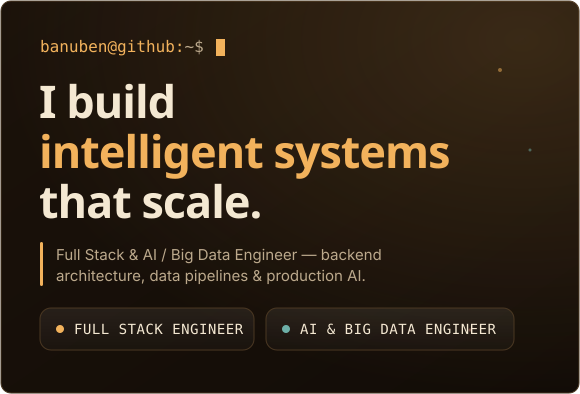
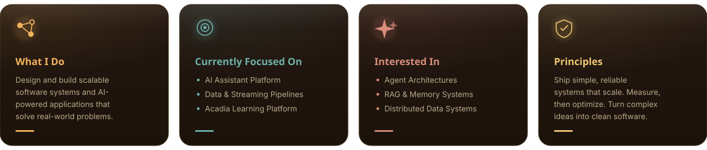
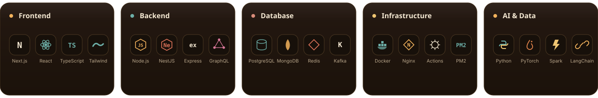
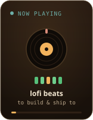
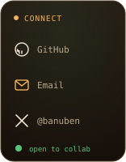

<!-- ░░ HERO  (text panel SVG  +  animated GIF scene, side by side) ░░ -->
<table align="center" border="0" cellspacing="0" cellpadding="0">
  <tr>
    <td valign="middle" style="padding:0;"></td>
    <td valign="middle" style="padding:0;"></td>
  </tr>
</table>

<!-- ░░ CARDS ░░ -->

  

<!-- ░░ WORKS  (collapsed — click to reveal) ░░ -->

<kbd>&nbsp;&nbsp;❯&nbsp; Works &nbsp;&nbsp;</kbd>

 
<a href="https://github.com/banuben/ai-assistant-platform"><b>ai-assistant-platform</b></a> &nbsp;·&nbsp;
<a href="https://github.com/banuben/ai-production-manager"><b>ai-production-manager</b></a> &nbsp;·&nbsp;
<a href="https://github.com/banuben/acadia"><b>acadia</b></a> &nbsp;·&nbsp;
<a href="https://github.com/banuben/data-pipeline-kit"><b>data-pipeline-kit</b></a>
  

<!-- ░░ TECH STACK ░░ -->
<h3 align="center">Tech Stack</h3>

  

<!-- live animated stack icons -->

  
  
  
  
  
  

 

  
  
  
  
  
  

 

  
  
  
  
  
  

<!-- ░░ GITHUB STATS ░░ -->
<h3 align="center">GitHub Stats</h3>

  
  

  

  

<!-- ░░ SNAKE ░░ -->
<h3 align="center">Contribution Snake</h3>

  <picture>
    <source media="(prefers-color-scheme: dark)"
      srcset="https://raw.githubusercontent.com/banuben/banuben/output/github-contribution-grid-snake-dark.svg" />
    <source media="(prefers-color-scheme: light)"
      srcset="https://raw.githubusercontent.com/banuben/banuben/output/github-contribution-grid-snake.svg" />
    
  </picture>

<!-- ░░ LO-FI BREAK  (Now Playing · scene · Connect) ░░ -->
<table align="center" border="0" cellspacing="0" cellpadding="0">
  <tr>
    <td valign="middle" style="padding:0 8px;"></td>
    <td valign="middle" style="padding:0;"></td>
    <td valign="middle" style="padding:0 8px;"></td>
  </tr>
</table>

<!-- ░░ FOOTER ░░ -->

  

  <a href="https://github.com/banuben">GitHub</a> ·
  <a href="mailto:bonu2530@gmail.com">Email</a>

  
  

